### h5 页面制作技巧与规范

##### 1、交互：慎用向右滑动的操作方式。
　　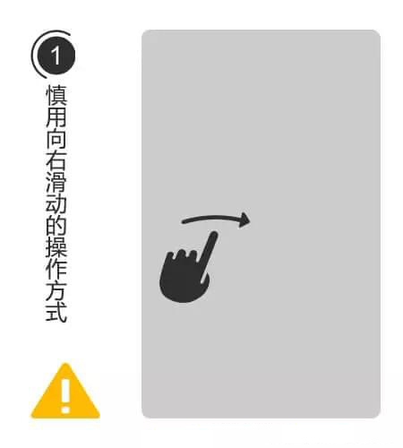

　　如：刮刮乐涂抹效果，左右滑动翻页等。
　　原因：苹果手机上，向右滑动容易触发返回“上一级页面”效果。
　　
##### 2、交互：慎用横屏展示效果。
　　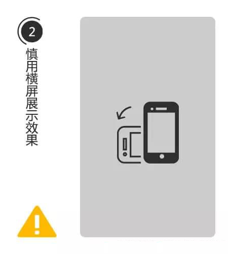

　　原因：体验上，需要用户设备开启屏幕旋转功能，才能正常观看，用户操作成本高。对不同屏幕的手机，长宽比例不一，难以展示最佳的视觉效果。
　　
##### 3、视觉：功能按钮等，远离页面底部（大概128px，这个尺寸不是固定值），具体看重构采用什么适配方式（仅供参考：640*1136 px，从上往下计算，主要内容在1008px内）。
　　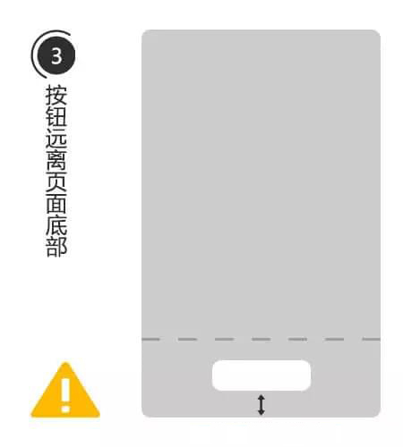

　　原因：更好的设备各种屏幕的手机，避免按钮被挡住。
　　
##### 4、视觉：慎用“光线叠加效果”或PS里面的“图层样式”效果。
　　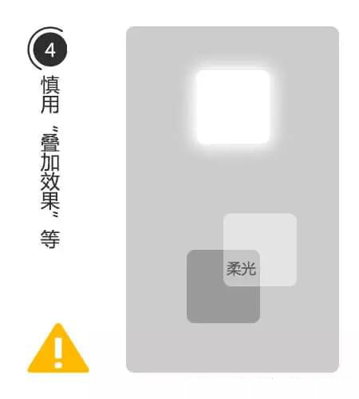

　　如：给图层加个“柔光”、“滤色”、“色相”等等效果，除非这个视觉元素可以合并为一体。
　　原因：给重构挖坑，导致不好切图，无法还原视觉效果。
　　
##### 5、视觉：矢量图？ 想做简单的动画？ 导出SVG格式试试！
　　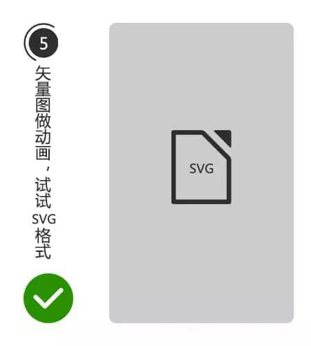

　　原因：能减少体积的事，为什么拒绝呢……
　　
##### 6、动画：尽量避免全屏动画，优先考虑局部动画的方式。
　　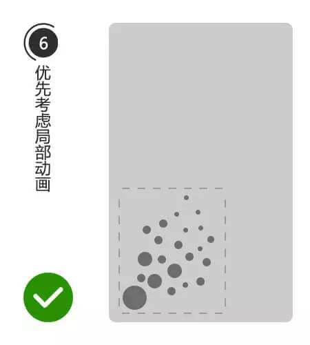

　　如：各种粒子效果全屏飘过等。
　　原因：如果呈现的视觉效果无法用代码实现，就意味着要用全屏尺寸的序列帧来处理，体积上会飙升，影响加载体验。
　　
##### 7、动画：序列帧压缩小技巧，静态的画面，保存较高质量。中间运动的模糊状态，大胆的压低画面质量吧。
　　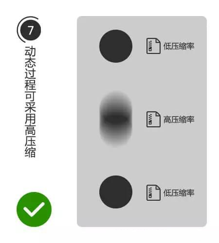

　　原因：压缩体积，运动状态就算有锯齿也不明显。
　　
##### 8、重构：图片请上“tinypng.com”，压缩下，有效减少体积。
　　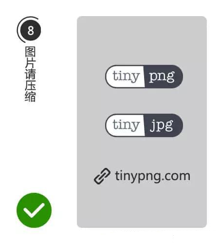

　　原因：额，这个也要说原因？好吧，偷偷告诉你，现在这网站不止可以压缩png，还可以压缩jpg，更重要的是……支持批量下载了！
　　
##### 9、重构：音乐请压缩下，能大大减少整体的体积。
　　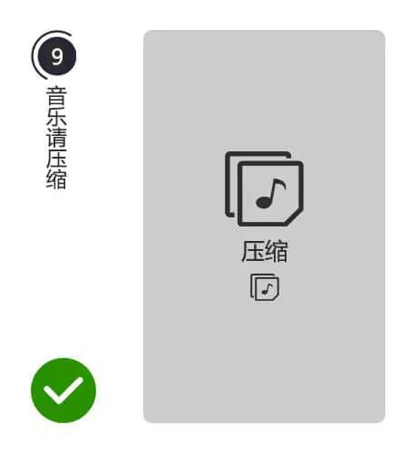

　　技巧：如果没有特殊要求，可以考虑弄成单声道音频文件，比特率48或更低就行了。
　　
##### 10、重构：安卓机不支持多个音频同时播放……意味着无法背景音乐跟音效同时播放！（苹果机则没问题）
　　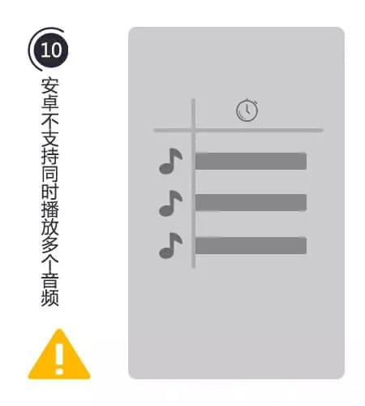
　　
##### 11、重构：视频无法自动播放，首次播放需要用户点击触发。
　　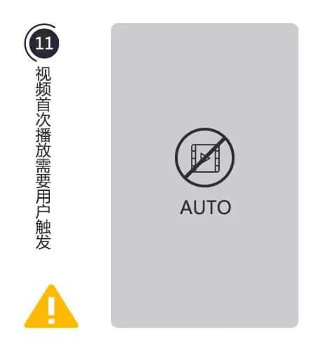

　　（视频用什么格式？建议用mp4格式，并用H.264编码器）
　　
##### 12、重构：测试请多留意“魅族”手机和华为P6/P7等，屏幕底部采用虚拟按钮的手机。设备容易出问题。
　　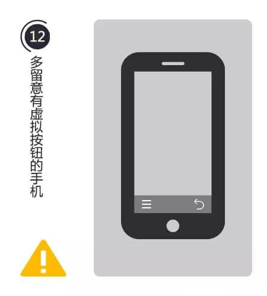
