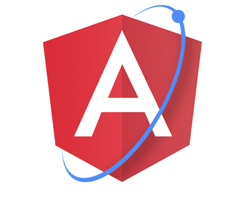
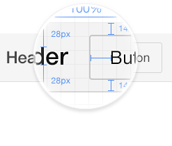
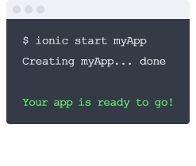

# 简介

>ionic是一个强大的 HTML5应用程序开发框架(HTML5 Hybrid Mobile App Framework)。
ionic 主要关注外观和体验，以及和你的应用程序的 UI 交互，特别适合用于基于 Hybird 模式的 HTML5 移动应用程序开发。 ionic是一个轻量的手机UI库，具有速度快，界面现代化、美观等特点。

##### 1). Ionic为性能而生-追求性能

在html5移动app开发中,速度是很重要的。Ionic在最新的移动设备中表现非常卓越，运行非常流畅。 操作最少的 DOM，非 jQuery，和硬件加速过渡，让您感觉到用html5开发的app也可以飞起来。

##### 2). Ionic完美的融合下一代移动框架 AngularJS- AngularJS移动端解决方案

Ionic可以说是AngularJS移动端解决方案，Ionic 利用 AngularJS创造出一款最适合开发丰富而强大应用的框架。 Ionic不仅如此优秀，而且它的核心架构也是为开发专业应用创建，和AngularJS完美融合。

##### 3). Ionic让你看不出混合应用和原生的区别-专注原生

Ionic以流行的原生移动开发SDK为蓝本，使开发过原生iOS或安卓app的任何人都容易理解。开始只需书写你的代码，完成时通过PhoneGap发布。一次开发，处处运行。

##### 4). 漂亮的设计让你立马爱上它

简洁，简单，而且实用。 Ionic为所有当前移动设备而设计，并且呈现完美。伴随众多流行移动组件，结构，交互规范，以及华丽的（且可扩展）的主题，你就不会怀疑你的生活为什么离不开它了。

##### 5). 一个强大的命令行

利用Ionic只需要一个命令就可以创建，构建，测试，部署你的应用程序在任何平台上。有令人惊叹的功能，只需要npm install -g ionic 就可以创建您的应用。

##### 6). 让html5移动app开发更简单更有趣-有趣的学习

您只要会html css js 还有懂基本的angularjs语法 就可以利用ionic 开发跨平台的移动app，完善的文档，让你学起来变得更简单，更有趣

##### 7). 傻瓜式开发

建立和维护开发人员和设计师热衷于Web技术。 Ionic专注于遵循标准的代码，这是具有前瞻性的，通过 Github管理。我们要使HTML5移动开发更加精彩简单。